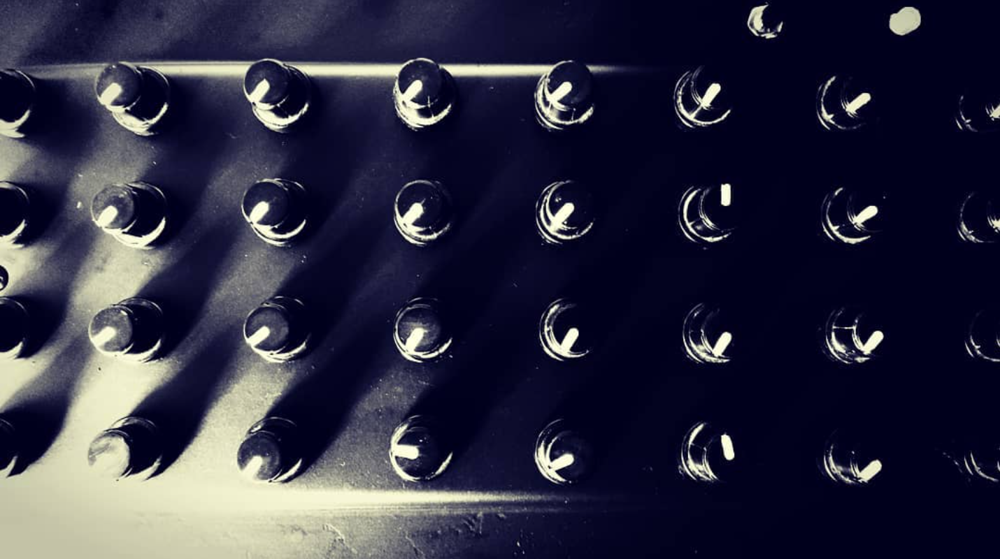

# EA-Arduino-MIDI-32

Low cost MIDI controller. 
Easy implementation. 
The knobs you use are generic. 
I implemented a filter (via soft) to avoid any noise produced by the knobs.

&nbsp;
### Features:

* 32 knobs
* 4 scenes
* 1 momentary button (scene selector)
* USB MIDI device
<pre>
</pre>
